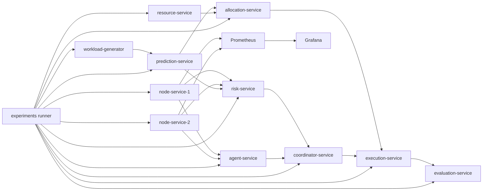
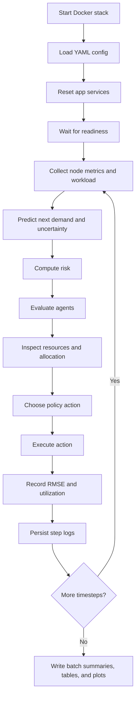

# Project

## Title

Multi-Agent Framework for Uncertainty-Aware Resource Allocation and Auto-Scaling in Distributed Systems

## Overview

This project implements a microservice-based simulation framework for uncertainty-aware resource allocation and auto-scaling in distributed systems. The system models node behavior, workload variation, forecasting, risk estimation, multi-agent evaluation, allocation, coordination, execution, monitoring, Docker deployment, Kubernetes deployment, and experiment orchestration.

The project is designed as a research-oriented prototype with:

- modular FastAPI services
- Prometheus and Grafana observability
- Docker-first reproducible execution
- Kubernetes manifests for deployment
- persistent experiment logging under `results/`
- repeated batch experiments with aggregate statistics, confidence intervals, and generated plots

## Problem Statement

Traditional auto-scaling strategies often rely on simple thresholds or reactive control. These approaches can struggle when workload behavior is uncertain or rapidly changing. This project explores whether combining forecasting, uncertainty, risk scoring, and multiple decision perspectives can produce more adaptive scaling behavior than simple baselines.

## Objectives

- simulate distributed node and workload behavior
- predict near-future demand with uncertainty
- estimate operational risk from utilization and uncertainty
- evaluate system state using multiple agent perspectives
- allocate resources according to demand
- coordinate scale decisions centrally
- execute actions in a simulated environment
- monitor the system with Prometheus and Grafana
- run reproducible research experiments with saved artifacts
- compare the proposed policy against threshold-only and reactive baselines

## Architecture

The framework is composed of the following services:

- `node-service`
  Simulates CPU and memory metrics for nodes and exposes both JSON and Prometheus-compatible metrics.

- `workload-generator`
  Produces a changing workload signal.

- `prediction-service`
  Predicts near-future demand and uncertainty from recent history.

- `risk-service`
  Converts utilization and prediction uncertainty into a normalized risk score.

- `agent-service`
  Computes performance, cost, and risk-oriented scores.

- `resource-service`
  Tracks available resources by node type.

- `allocation-service`
  Produces a greedy resource allocation plan.

- `coordinator-service`
  Implements the original central scale-decision logic.

- `execution-service`
  Simulates the execution of actions such as scaling.

- `evaluation-service`
  Tracks RMSE and utilization across observations.

- `experiments`
  Runs single experiments and repeated comparison batches, then writes persistent results to disk.

### System Architecture Diagram



### Experiment Workflow Diagram



### Service Summary Table

| Service | Role | Main Output |
|---|---|---|
| `node-service` | Simulates node CPU and memory | `/metrics`, `/metrics/prometheus` |
| `workload-generator` | Generates changing load | `/load` |
| `prediction-service` | Predicts next-step demand and uncertainty | `/predict` |
| `risk-service` | Computes normalized operational risk | `/risk` |
| `agent-service` | Produces performance, cost, and risk scores | `/evaluate` |
| `resource-service` | Tracks available resources | `/resources` |
| `allocation-service` | Produces greedy allocation plan | `/allocate` |
| `coordinator-service` | Produces central decision logic | `/decide` |
| `execution-service` | Simulates action execution | `/execute` |
| `evaluation-service` | Tracks RMSE and utilization | `/metrics` |
| `experiments` | Runs single and batch experiments | result artifacts under `results/` |

## Implemented Phases

| Phase | Capability |
|---|---|
| Phase 1 | node and workload simulation |
| Phase 2 | Prometheus and Grafana monitoring |
| Phase 3 | forecasting with uncertainty |
| Phase 4 | risk scoring |
| Phase 5 | multi-agent evaluation |
| Phase 6 | resource pool management |
| Phase 7 | allocation planning |
| Phase 8 | coordination logic |
| Phase 9 | execution simulation |
| Phase 10 | evaluation metrics |
| Phase 11 | Dockerization |
| Phase 12 | Kubernetes deployment manifests |

## Directory Highlights

- [services](d:/DS1/Multi-Agent-Framework-for-Uncertainty-Aware-Resource-Allocation-and-Auto-Scaling-in-DS/services)
- [experiments](d:/DS1/Multi-Agent-Framework-for-Uncertainty-Aware-Resource-Allocation-and-Auto-Scaling-in-DS/experiments)
- [infra](d:/DS1/Multi-Agent-Framework-for-Uncertainty-Aware-Resource-Allocation-and-Auto-Scaling-in-DS/infra)
- [README.md](d:/DS1/Multi-Agent-Framework-for-Uncertainty-Aware-Resource-Allocation-and-Auto-Scaling-in-DS/README.md)
- [RESULTS.md](d:/DS1/Multi-Agent-Framework-for-Uncertainty-Aware-Resource-Allocation-and-Auto-Scaling-in-DS/RESULTS.md)

## How It Runs

The recommended workflow is Docker-first.

Start the stack:

```powershell
cd d:\DS1\Multi-Agent-Framework-for-Uncertainty-Aware-Resource-Allocation-and-Auto-Scaling-in-DS
docker compose up --build -d
```

Run a single experiment:

```powershell
python experiments/run_experiment.py --name baseline-study --config experiments/configs/baseline.yaml
```

Run a repeated batch:

```powershell
python experiments/run_batch.py --batch-name paper-batch --runs-per-scenario 3
```

Run the strongest validated policy comparison:

```powershell
python experiments/run_batch.py --batch-name policy-compare-10b --runs-per-scenario 10 --scenario proposed=experiments/configs/proposed_baseline_long.yaml --scenario threshold=experiments/configs/threshold_baseline_long.yaml --scenario reactive=experiments/configs/reactive_baseline_long.yaml
```

## Experiment Outputs

Each single run writes:

```text
results/<experiment-name>/<timestamp>/
```

with:

- `config.yaml`
- `step_logs.csv`
- `step_logs.jsonl`
- `summary.json`
- `run.log`

Each batch writes:

```text
results/<batch-name>/<timestamp>/
```

with:

- `aggregate_summary.json`
- `aggregate_table.csv`
- `aggregate_table.md`
- `aggregate_table.tex`
- `paper_summary.md`
- `batch.log`
- `step_metrics.svg`

## Policies Compared

The experiment system supports three policies:

- `proposed`
  Uses prediction and risk-aware decision logic.

- `threshold`
  Uses direct utilization and workload thresholds.

- `reactive`
  Uses short-term workload change and utilization.

### Policy Comparison Table

The strongest completed comparison is:

- [results/policy-compare-10b/20260329T173343Z](d:/DS1/Multi-Agent-Framework-for-Uncertainty-Aware-Resource-Allocation-and-Auto-Scaling-in-DS/results/policy-compare-10b/20260329T173343Z)

| Policy | Runs | RMSE Mean | Utilization Mean | Prediction Mean | Risk Mean | Dominant Action | Action Profile |
|---|---:|---:|---:|---:|---:|---|---|
| `proposed` | 10 | 0.058 | 0.5976 | 0.5367 | 0.3791 | `hold` | `hold: 170, scale_up: 24, scale_down: 6` |
| `threshold` | 10 | 0.053 | 0.5990 | 0.5398 | 0.3817 | `hold` | `hold: 199, scale_up: 1` |
| `reactive` | 10 | 0.061 | 0.6065 | 0.5131 | 0.3870 | `hold` | `hold: 200` |

### Scenario Comparison Table

The earlier workload-regime batch remains useful for showing scenario sensitivity:

- [results/paper-batch/20260329T170629Z](d:/DS1/Multi-Agent-Framework-for-Uncertainty-Aware-Resource-Allocation-and-Auto-Scaling-in-DS/results/paper-batch/20260329T170629Z)

| Scenario | Runs | RMSE Mean | Utilization Mean | Prediction Mean | Risk Mean | Dominant Action |
|---|---:|---:|---:|---:|---:|---|
| `baseline` | 3 | 0.0667 | 0.6600 | 0.5847 | 0.3787 | `hold` |
| `bursty` | 3 | 0.1100 | 0.7111 | 0.7989 | 0.4556 | `scale_up` |
| `mixed` | 3 | 0.1067 | 0.6607 | 0.2613 | 0.3847 | `hold` |

## Validation Summary

The system has been validated across:

- individual service endpoint checks
- Prometheus metric exposure
- Docker Compose startup
- Kubernetes deployment
- single-run experiment execution
- repeated scenario batches
- repeated policy-comparison batches

The strongest completed comparison is the 30-run batch:

- [results/policy-compare-10b/20260329T173343Z](d:/DS1/Multi-Agent-Framework-for-Uncertainty-Aware-Resource-Allocation-and-Auto-Scaling-in-DS/results/policy-compare-10b/20260329T173343Z)

Key outcome from that batch:

- all 30 runs succeeded
- each policy was tested for 10 runs
- each run used 20 timesteps
- confidence intervals were computed
- the proposed policy showed more adaptive action behavior than the baseline policies

### Validation Matrix

| Area | What Was Validated | Outcome |
|---|---|---|
| Service APIs | endpoints for all phases 1-10 | passed |
| Monitoring | Prometheus scrape and Grafana provisioning | passed |
| Docker | `docker compose` startup and experiment execution | passed |
| Kubernetes | manifests applied and pods reached `Running` | passed |
| Single-run experiments | named runs with persistent artifacts | passed |
| Batch experiments | repeated scenario and policy comparison runs | passed |
| Reporting | JSON, CSV, Markdown, LaTeX, and SVG outputs | passed |

## Current Research Strength

This project is now much stronger than a simple prototype because it includes:

- repeated trials
- explicit policy baselines
- confidence intervals
- persistent artifacts
- reusable paper-ready tables
- generated plots

It is best described as a strong research prototype with a reproducible evaluation workflow.

## Recommended Next Steps

- increase timesteps further for stress testing
- add more workload and fault scenarios
- add response-time or SLA-oriented metrics
- expand baseline methods further
- include formal statistical significance testing if needed for publication

## References Inside The Repo

- [README.md](d:/DS1/Multi-Agent-Framework-for-Uncertainty-Aware-Resource-Allocation-and-Auto-Scaling-in-DS/README.md)
- [RESULTS.md](d:/DS1/Multi-Agent-Framework-for-Uncertainty-Aware-Resource-Allocation-and-Auto-Scaling-in-DS/RESULTS.md)
