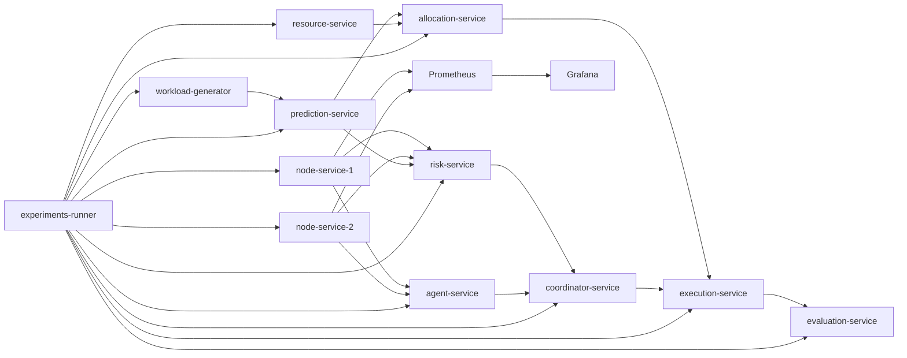
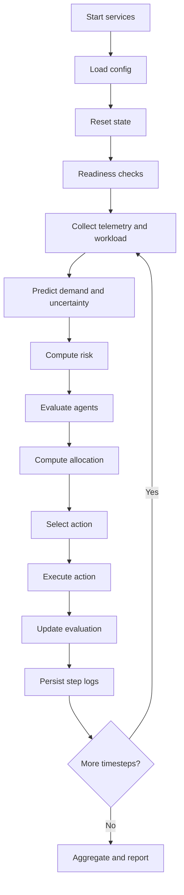

# Multi-Agent Framework for Uncertainty-Aware Resource Allocation and Auto-Scaling in Distributed Systems

## Abstract

Distributed systems increasingly operate in uncertain and rapidly changing environments where static threshold-based auto-scaling strategies often fail to balance performance, reliability, and cost. This paper presents a detailed research prototype: a microservice-based framework for uncertainty-aware resource allocation and auto-scaling in distributed systems. The framework unifies workload generation, node telemetry simulation, short-horizon forecasting, uncertainty-aware risk modeling, multi-agent utility evaluation, greedy allocation planning, centralized policy coordination, simulated action execution, and evaluation services in one reproducible control pipeline.

The implementation uses FastAPI microservices, Prometheus-compatible instrumentation, Grafana dashboards, Docker Compose orchestration, Kubernetes deployment manifests, and YAML-based experiment definitions. Reproducibility is prioritized through deterministic run-level artifact persistence, repeated batch execution, confidence interval reporting, and automated generation of publication-ready outputs in Markdown, LaTeX, CSV, JSON, and SVG formats.

Comparative experiments across three policies (`proposed`, `threshold`, `reactive`) using a validated 30-run batch (10 runs per policy, 20 timesteps per run) show that the proposed uncertainty-aware strategy demonstrates richer behavioral adaptivity, achieves the lowest mean risk among compared methods, and maintains comparable RMSE and utilization in the synthetic setting. The project is best interpreted as a strong research artifact and extensible platform for future trace-driven and production-aligned evaluation.

Keywords: distributed systems, auto-scaling, uncertainty-aware control, multi-agent systems, cloud resource management, reproducibility.

## 1. Introduction

Elasticity is fundamental to distributed systems. Modern applications are expected to maintain service quality despite demand fluctuations caused by user activity, regional behavior, upstream dependencies, and external events. Auto-scaling mechanisms are therefore central to system stability and cost control.

Most commonly deployed controllers remain rule-based and reactive. A typical setup scales up when CPU crosses an upper threshold and scales down when it falls below a lower threshold. While these approaches are simple and interpretable, they often fail in uncertain settings: they may react late to hidden growth, overreact to noise, oscillate around boundaries, or remain overly conservative under ambiguous telemetry.

This paper addresses that gap by introducing an uncertainty-aware scaling framework. Instead of relying solely on current utilization, the framework incorporates predictive context and uncertainty estimates into risk-aware decision making. A multi-agent layer then evaluates trade-offs among performance, cost, and risk before actions are selected and executed.

The goal is not to claim immediate production superiority. Rather, the contribution is a complete and reproducible experimentation framework that allows transparent policy comparison under controlled conditions.

### 1.1 Motivation

Three concerns motivate this work:

1. Workload volatility is intrinsic to distributed systems and can invalidate static control assumptions.
2. Decisions under ambiguity require confidence awareness, not only point estimates.
3. Many scaling studies lack reproducible pipelines with persistent artifacts and repeated-run statistics.

### 1.2 Research Question

How does an uncertainty-aware multi-agent auto-scaling policy behave, relative to threshold-based and reactive baselines, in a controlled distributed-system simulation?

### 1.3 Objectives

1. Build an end-to-end uncertainty-aware control architecture using independent microservices.
2. Provide a reproducible experimental workflow with deterministic run and batch outputs.
3. Compare policy behavior across repeated runs and standardized scenarios.
4. Quantify outcomes through RMSE, utilization, prediction trends, risk levels, and action distributions.
5. Enable future extension toward realistic traces, stronger models, and richer metrics.

### 1.4 Contributions

1. A modular architecture separating sensing, prediction, risk scoring, agent evaluation, allocation, coordination, execution, and evaluation.
2. A policy pathway that explicitly integrates uncertainty into risk-informed scaling decisions.
3. A research-grade experiment runner with confidence intervals and multi-format paper-ready outputs.
4. Practical deployment and observability support through Docker, Kubernetes manifests, Prometheus, and Grafana.

## 2. Background and Related Foundations

### 2.1 Auto-Scaling as a Control Problem

Auto-scaling can be viewed as a closed-loop control problem in which observed system state informs an action that changes future state. The key challenge is delayed and uncertain feedback. By the time a scaling action takes effect, workload conditions may already have changed.

### 2.2 Limits of Fixed Thresholds

Fixed thresholds are easy to configure but sensitive to context mismatch. A threshold tuned for stable demand may perform poorly during bursty periods. Additionally, fixed rules typically do not represent confidence in forecasted demand and may mis-handle noisy inputs.

### 2.3 Role of Uncertainty in Decision Quality

Two states with the same predicted load can require different actions if prediction confidence differs. High uncertainty under elevated utilization should often trigger cautious behavior. Explicitly modeling uncertainty helps prevent overconfident decisioning.

### 2.4 Multi-Agent Utility Perspective

Real-world scaling is multi-objective. Performance, cost, and risk objectives can conflict. The multi-agent layer in this framework models these perspectives separately before combining them in coordination logic.

### 2.5 Reproducibility as a First-Class Requirement

System-control research often suffers from non-reproducible demos. This work emphasizes persistent logs, repeatable configuration, batch statistics, and report automation so findings can be audited and extended.

## 3. Problem Formulation

At each timestep `t`, the controller observes system state `S_t` and selects action `a_t`.

`S_t = {x_t, w_t, p_t, u_t, r_t, q_t}`

where:

- `x_t`: node telemetry (CPU, memory)
- `w_t`: workload signal
- `p_t`: predicted near-future demand
- `u_t`: prediction uncertainty
- `r_t`: risk score derived from utilization and uncertainty
- `q_t`: resource inventory and allocation context

Action space:

`a_t ? {scale_up, hold, scale_down}`

### 3.1 Conceptual Objective

The control intent is to minimize a weighted operational loss:

`L = a * performance_error + ß * resource_waste + ? * risk_exposure`

In this prototype, the weights are implicit in rule design and multi-agent utility composition.

### 3.2 Risk Function Requirements

The risk model is designed to be monotonic and interpretable:

`r_t = f(utilization_t, uncertainty_t)`

Desired properties:

1. Higher utilization should not reduce risk.
2. Higher uncertainty should not reduce risk.
3. Risk values should be normalized for cross-run comparability.

### 3.3 Policy Comparison Framing

Three policy families are compared:

1. `proposed`: uncertainty-aware, multi-signal policy
2. `threshold`: fixed-rule baseline
3. `reactive`: trend-based baseline without explicit uncertainty

The primary analysis goal is behavior under uncertainty, not only point metric superiority.

## 4. System Architecture

The system is implemented as independent FastAPI microservices orchestrated by an experiment runner.

### 4.1 End-to-End Pipeline



### 4.2 Service Summary

| Service | Main Responsibility | Output |
|---|---|---|
| `node-service` | Simulate node telemetry | `/metrics`, `/metrics/prometheus` |
| `workload-generator` | Generate dynamic workload | `/load` |
| `prediction-service` | Forecast demand + uncertainty | `/predict` |
| `risk-service` | Compute normalized risk | `/risk` |
| `agent-service` | Evaluate performance/cost/risk utilities | `/evaluate` |
| `resource-service` | Expose available resources | `/resources` |
| `allocation-service` | Build greedy allocation plans | `/allocate` |
| `coordinator-service` | Select final decision | `/decide` |
| `execution-service` | Simulate action execution | `/execute` |
| `evaluation-service` | Compute run-level metrics | `/metrics` |
| `experiments` | Orchestrate runs and reports | `results/` |

### 4.3 Architectural Principles

1. Single responsibility per microservice.
2. API contract clarity and composability.
3. Observability and diagnostics by design.
4. Reproducible execution and persistent evidence.
## 5. Component-Level Design Details

### 5.1 Node Service Design

The node service simulates CPU and memory trajectories for each node instance. Two independent node services are used to emulate multi-node observation and allow cross-node variance in telemetry.

Key interface goals:

1. Consistent metric schema for orchestrator parsing.
2. Prometheus endpoint compatibility for external scraping.
3. Reset capability to support clean run boundaries.

### 5.2 Workload Generator Design

The workload generator produces controlled synthetic load patterns. It supports baseline, bursty, and mixed regimes to test policy sensitivity.

Design choices:

1. Lightweight generation for fast repeated execution.
2. Scenario shaping to represent distinct demand dynamics.
3. Deterministic behavior under fixed config for reproducibility.

### 5.3 Prediction Service Design

The prediction service consumes recent workload history and returns a pair:

1. next-step demand estimate
2. uncertainty score

Even if the model is lightweight, explicit uncertainty output is central because it allows downstream risk-aware behavior.

### 5.4 Risk Service Design

Risk computation combines utilization pressure and uncertainty magnitude into a normalized score. The service is intentionally transparent and interpretable rather than opaque.

Design objective:

- Rising uncertainty and utilization should increase risk pressure.

### 5.5 Agent Service Design

The agent layer outputs three utility scores:

1. performance-oriented
2. cost-oriented
3. risk-oriented

This decomposition supports interpretable trade-off analysis and future replacement with more advanced agent implementations.

### 5.6 Resource and Allocation Design

The `resource-service` tracks available resource inventory. The `allocation-service` computes a greedy allocation plan from predicted demand and resource constraints.

Benefits:

1. Separates demand prediction from allocation feasibility.
2. Enables independent testing of planning logic.
3. Supports future planner upgrades without pipeline redesign.

### 5.7 Coordinator and Execution Design

`coordinator-service` performs final action selection from multi-signal inputs. `execution-service` applies selected actions in simulation and records action history for evaluation.

This separation ensures action logic and state-transition logic remain independently inspectable.

### 5.8 Evaluation Service Design

The evaluation service tracks run-level quality indicators, especially RMSE and utilization. It also supports aggregation over timesteps and handoff to reporting layers.

## 6. Data Flow, Contracts, and Failure Handling

### 6.1 Per-Timestep Data Flow

1. Pull node telemetry and workload.
2. Forecast demand and uncertainty.
3. Compute risk.
4. Evaluate multi-agent utility scores.
5. Compute allocation feasibility.
6. Select policy action.
7. Execute action.
8. Record metrics and persist step artifacts.

### 6.2 API Contract Expectations

For stable orchestration, each service API should maintain:

1. backward-compatible request/response schemas
2. explicit error fields or status semantics
3. deterministic output under deterministic input conditions

### 6.3 Failure Handling Strategy

In controlled experiments, failures should be surfaced early and logged with context. Recommended handling:

1. readiness gates before timestep loop begins
2. clear timeout behavior per service call
3. run termination with reasoned logs instead of silent continuation

## 7. Technology and Implementation Stack

### 7.1 Core Stack

- Python 3.11
- FastAPI and Uvicorn
- Prometheus client instrumentation
- Docker Compose orchestration
- Kubernetes manifests for deployment portability
- YAML configuration for experiment declarations

### 7.2 Repository Layout

- [`services`](/d:/DS1/Multi-Agent-Framework-for-Uncertainty-Aware-Resource-Allocation-and-Auto-Scaling-in-DS/services)
- [`experiments`](/d:/DS1/Multi-Agent-Framework-for-Uncertainty-Aware-Resource-Allocation-and-Auto-Scaling-in-DS/experiments)
- [`infra`](/d:/DS1/Multi-Agent-Framework-for-Uncertainty-Aware-Resource-Allocation-and-Auto-Scaling-in-DS/infra)

### 7.3 Experiment Modules

Key experiment-side modules:

1. `config_loader.py`
2. `orchestrator.py`
3. `run_experiment.py`
4. `run_batch.py`
5. `reporting.py`

### 7.4 Configuration Model

YAML configuration externalizes experiment parameters such as:

1. workload scenario mode
2. run count and timestep length
3. selected policy
4. report and logging options

This enables repeatability and easier comparison across batches.

## 8. Reproducibility and Artifact Engineering

### 8.1 Per-Run Artifacts

Each run persists:

- `config.yaml`
- `step_logs.csv`
- `step_logs.jsonl`
- `summary.json`
- `run.log`

### 8.2 Per-Batch Artifacts

Each batch persists:

- `aggregate_summary.json`
- `aggregate_table.csv`
- `aggregate_table.md`
- `aggregate_table.tex`
- `paper_summary.md`
- `batch.log`
- `step_metrics.svg`

### 8.3 Why Artifact Discipline Matters

Persistent artifacts improve:

1. auditability
2. reproducibility
3. debugging speed
4. paper/report generation quality

## 9. Observability Strategy

### 9.1 Metrics and Monitoring

Prometheus scraping captures runtime telemetry from instrumented services. This enables quantitative visibility into system dynamics during experiments.

### 9.2 Dashboarding with Grafana

Grafana visualizations support analysis of:

1. utilization trends
2. workload evolution
3. risk and action behavior over time
4. service health and responsiveness

### 9.3 Diagnostic Value

Observability shortens root-cause analysis cycles. Policy anomalies such as over-conservative holds can be mapped to forecast confidence, risk trajectories, or allocation constraints.

## 10. Experimental Methodology

### 10.1 Lifecycle



### 10.2 Compared Policies

1. `proposed`: uses prediction and uncertainty-aware risk.
2. `threshold`: uses fixed thresholds from direct utilization/workload.
3. `reactive`: uses short-window trend reaction without uncertainty awareness.

### 10.3 Validated Batch Setup

- 10 runs per policy
- 20 timesteps per run
- 3 policies
- 30 total runs

Reference:

- [`results/policy-compare-10b/20260329T173343Z`](/d:/DS1/Multi-Agent-Framework-for-Uncertainty-Aware-Resource-Allocation-and-Auto-Scaling-in-DS/results/policy-compare-10b/20260329T173343Z)

### 10.4 Statistical Method

For each policy, report:

1. mean
2. standard deviation
3. 95 percent confidence interval

across:

1. final RMSE
2. average utilization
3. average prediction
4. average risk

### 10.5 Validity Guardrails

To improve experiment quality:

1. restart services to reset in-memory state between runs
2. enforce readiness checks before loop entry
3. persist both step-level and aggregate records
4. separate scenario comparison from policy comparison
## 11. Experimental Results

### 11.1 Aggregate Policy Comparison

| Scenario | Policy | Runs | Success | Fail | Success Rate | RMSE (Mean +- Std, CI95) | Utilization (Mean +- Std, CI95) | Prediction (Mean +- Std, CI95) | Risk (Mean +- Std, CI95) | Dominant Action | Actions |
|---|---|---:|---:|---:|---:|---:|---:|---:|---:|---|---|
| proposed | proposed | 10 | 10 | 0 | 100.0% | 0.058 +- 0.014, CI95=0.0087 | 0.5976 +- 0.0438, CI95=0.0271 | 0.5367 +- 0.0892, CI95=0.0553 | 0.3791 +- 0.0354, CI95=0.022 | hold | `{"hold": 170, "scale_down": 6, "scale_up": 24}` |
| threshold | threshold | 10 | 10 | 0 | 100.0% | 0.053 +- 0.0095, CI95=0.0059 | 0.599 +- 0.0384, CI95=0.0238 | 0.5398 +- 0.1211, CI95=0.0751 | 0.3817 +- 0.028, CI95=0.0173 | hold | `{"hold": 199, "scale_up": 1}` |
| reactive | reactive | 10 | 10 | 0 | 100.0% | 0.061 +- 0.016, CI95=0.0099 | 0.6065 +- 0.0452, CI95=0.028 | 0.5131 +- 0.1387, CI95=0.086 | 0.387 +- 0.0331, CI95=0.0205 | hold | `{"hold": 200}` |

### 11.2 Compact Comparison

| Policy | RMSE Mean | Utilization Mean | Prediction Mean | Risk Mean | Action Behavior |
|---|---:|---:|---:|---:|---|
| `proposed` | 0.058 | 0.5976 | 0.5367 | 0.3791 | adaptive (`hold`, `scale_up`, `scale_down`) |
| `threshold` | 0.053 | 0.5990 | 0.5398 | 0.3817 | mostly static (`hold`) |
| `reactive` | 0.061 | 0.6065 | 0.5131 | 0.3870 | static (`hold` only) |

### 11.3 Scenario Comparison Reference

Additional scenario-level batch:

- [`results/paper-batch/20260329T170629Z`](/d:/DS1/Multi-Agent-Framework-for-Uncertainty-Aware-Resource-Allocation-and-Auto-Scaling-in-DS/results/paper-batch/20260329T170629Z)

| Scenario | Runs | RMSE Mean | Utilization Mean | Prediction Mean | Risk Mean | Dominant Action |
|---|---:|---:|---:|---:|---:|---|
| `baseline` | 3 | 0.0667 | 0.6600 | 0.5847 | 0.3787 | `hold` |
| `bursty` | 3 | 0.1100 | 0.7111 | 0.7989 | 0.4556 | `scale_up` |
| `mixed` | 3 | 0.1067 | 0.6607 | 0.2613 | 0.3847 | `hold` |

## 12. Result Analysis and Discussion

### 12.1 Pipeline Stability

All 30 policy-comparison runs succeeded. This is a strong practical signal that the orchestration and service composition are reliable enough for repeated experimentation.

### 12.2 Adaptivity as the Dominant Difference

The most meaningful difference is action distribution:

1. `proposed` performs bidirectional scaling adjustments.
2. `threshold` is largely `hold` with minimal scaling activity.
3. `reactive` remains entirely `hold`.

This indicates the proposed policy changes controller behavior qualitatively, not just numerically.

### 12.3 Risk Behavior

The proposed policy obtains the lowest mean risk (`0.3791`). The margin is small but directionally consistent with uncertainty-aware design goals.

### 12.4 RMSE and Utilization Interpretation

RMSE and utilization differences are modest across policies. In synthetic settings with lightweight models and bounded transitions, this is expected. Similar metric levels do not negate behavioral improvements.

### 12.5 Practical Takeaway

The key finding is controlled adaptivity without destabilization of core metrics. This supports the value of uncertainty-aware control design as a behavioral improvement pathway.

## 13. Comparative Policy Assessment

### 13.1 Proposed Policy

Advantages:

1. Explicit uncertainty integration
2. Richer action diversity
3. Lowest mean risk in validated batch

Trade-offs:

1. Slightly higher RMSE than threshold baseline in this specific setup
2. Increased design complexity compared with simple rules

### 13.2 Threshold Baseline

Advantages:

1. Simplicity and interpretability
2. Competitive RMSE under synthetic conditions

Limitations:

1. Near-static behavior in tested scenario
2. Potential fragility under regime shifts

### 13.3 Reactive Baseline

Advantages:

1. Minimal implementation complexity
2. Deterministic decision profile

Limitations:

1. No explicit uncertainty reasoning
2. No scaling adaptivity in validated batch
3. Highest mean risk among compared policies

## 14. Reproducibility and Validation

### 14.1 Validation Matrix

| Validation Area | Evidence | Outcome |
|---|---|---|
| Service APIs | phase-by-phase endpoint checks | passed |
| Observability | Prometheus and Grafana integration | passed |
| Docker execution | compose orchestration and runner lifecycle | passed |
| Kubernetes assets | manifests applied with running pods | passed |
| Single-run persistence | full run bundles in `results/` | passed |
| Batch reproducibility | repeated policy and scenario runs | passed |
| Reporting outputs | JSON, CSV, Markdown, LaTeX, SVG | passed |

### 14.2 Research Utility

The framework is suitable for:

1. project demonstrations
2. coursework and thesis experiments
3. baseline comparisons for new policies
4. extension studies on forecasting and uncertainty modeling

### 14.3 Lessons on Research Engineering

1. Modular architecture accelerates iteration and debugging.
2. Artifact persistence is as important as model logic for credible experiments.
3. Confidence intervals materially improve interpretability over single-run results.

## 15. Limitations and Threats to Validity

### 15.1 Synthetic Environment Constraint

The workload and telemetry are simulated. Results should be interpreted as controlled prototype evidence and not production guarantees.

### 15.2 Simplified Model Stack

Forecasting, risk, and agent logic are intentionally lightweight. They demonstrate integration value but are not state-of-the-art modeling approaches.

### 15.3 Metric Scope Constraint

Current evaluation emphasizes RMSE, utilization, prediction, risk, and action distribution. It does not yet include:

1. latency distributions
2. throughput
3. SLO or SLA violation counts
4. queueing delay
5. explicit infrastructure cost curves

### 15.4 Statistical Scope Constraint

Confidence intervals are reported, but formal significance testing and larger run counts are still pending for stronger inferential claims.

### 15.5 External Validity Constraint

Generalization to production requires trace-driven replay, richer topology modeling, and realistic actuation latency.
## 16. Future Work Roadmap

### 16.1 Data Realism

1. Integrate production trace replay datasets.
2. Add long-horizon non-stationary demand simulations.
3. Model cross-service correlated bursts.

### 16.2 Modeling Enhancements

1. Replace lightweight predictor with probabilistic forecasting models.
2. Evaluate uncertainty calibration quality explicitly.
3. Explore alternate risk fusion functions and sensitivity profiles.

### 16.3 Policy and Control Enhancements

1. Conduct ablation studies to isolate each pipeline module's contribution.
2. Evaluate hybrid policies combining rules with learned components.
3. Explore decentralized multi-agent coordination strategies.

### 16.4 Evaluation Enhancements

1. Add latency and throughput metrics.
2. Add SLO violation and tail-latency tracking.
3. Add explicit cost objective with budget constraints.
4. Add formal significance testing and effect size reporting.

### 16.5 Toward Production Readiness

1. Integrate fault-injection and resilience testing.
2. Add robust retries, circuit breakers, and timeout policies.
3. Incorporate security hardening and contract validation suites.

## 17. Deployment and Operations Notes

### 17.1 Docker-First Workflow

Docker Compose simplifies local reproducibility by packaging service dependencies and startup order. It supports rapid iteration for development and experiment reruns.

### 17.2 Kubernetes Portability

Kubernetes manifests provide a path toward cluster-based deployment and demonstrate operational portability beyond local environments.

### 17.3 Recommended Operational Checks

Before running experiments:

1. verify service health endpoints
2. confirm Prometheus scrape targets are available
3. reset persistent state if required by config
4. validate run directory permissions for artifact generation

After running experiments:

1. inspect run logs for silent API retries or soft failures
2. verify aggregate table consistency across output formats
3. archive result directories with timestamps for provenance

## 18. Ethical and Practical Considerations

Although the current framework is synthetic, auto-scaling decisions in real systems can affect user experience, operational cost, and service fairness. Future production use should include:

1. explicit safety constraints for under-provisioning risk
2. transparency in decision rationale where possible
3. controlled rollout and rollback mechanisms
4. auditability of policy changes and model updates

## 19. Practical Reproduction Guide

### 19.1 Prerequisites

1. Docker and Docker Compose
2. Python environment compatible with repository requirements
3. Access to experiment configuration files and `results/` output path

### 19.2 Suggested Reproduction Steps

1. Start all services.
2. Confirm endpoint readiness.
3. Run one single experiment for smoke validation.
4. Run batch comparison for policy evidence.
5. Inspect run-level and batch-level artifacts.
6. Export or include aggregate tables in the final report.

### 19.3 Expected Outputs

A successful batch should produce:

1. per-run configs, logs, and summaries
2. aggregate summary JSON
3. aggregate tables in CSV, Markdown, and LaTeX
4. paper summary markdown
5. step-level SVG visualization

## 20. Report-Ready Statements

### 20.1 Contribution Statement

This work introduces a reproducible microservice framework for uncertainty-aware auto-scaling in distributed systems and demonstrates through repeated-run evaluation that uncertainty-aware control can improve behavioral adaptivity and risk profile while preserving core metric stability under synthetic conditions.

### 20.2 Results Statement

In the validated 30-run policy comparison, the proposed policy achieved the lowest mean risk (`0.3791`) and showed active bidirectional scaling behavior (`scale_up`, `hold`, `scale_down`), whereas threshold and reactive baselines remained largely static.

### 20.3 Limitation Statement

Because evaluation is currently synthetic and model components are lightweight, findings should be interpreted as prototype evidence rather than production-performance proof. Additional trace-driven and statistically stronger evaluation is required for broader claims.

## 21. Appendix A: Metric Definitions

1. RMSE: error between predicted and observed workload trends.
2. Average utilization: mean utilization over timesteps and runs.
3. Average prediction: mean predicted load over timesteps.
4. Average risk: mean normalized risk score.
5. Action distribution: frequency of `scale_up`, `hold`, `scale_down`.

## 22. Appendix B: Artifact Quality Checklist

### 22.1 Per-Run Checklist

1. `config.yaml` present and consistent with run intent.
2. `step_logs.csv` and `step_logs.jsonl` populated.
3. `summary.json` generated with expected fields.
4. `run.log` free from unhandled exceptions.

### 22.2 Per-Batch Checklist

1. `aggregate_summary.json` generated.
2. `aggregate_table.csv` and `aggregate_table.md` consistent.
3. `aggregate_table.tex` renderable in report template.
4. `paper_summary.md` aligns with aggregate values.
5. `step_metrics.svg` viewable and legible.
6. `batch.log` complete and timestamped.

## 23. Appendix C: Suggested Experiment Matrix

| Dimension | Variant 1 | Variant 2 | Variant 3 |
|---|---|---|---|
| Workload regime | baseline | bursty | adversarial burst |
| Forecast model | lightweight | probabilistic | ensemble |
| Policy family | threshold | uncertainty-aware | hybrid |
| Metric set | RMSE/utilization/risk | plus latency/SLO | plus cost objective |
| Run count | 10 | 30 | 50 |

## 24. Conclusion

This paper presented a complete uncertainty-aware auto-scaling research framework built as a modular, observable, and reproducible microservice pipeline. The architecture supports full-loop experimentation, from telemetry and prediction to risk-aware decisioning and evaluation. The strongest validated policy batch shows that uncertainty-aware control can produce more adaptive action behavior and lower average risk while maintaining comparable RMSE and utilization in a synthetic environment.

The project should be understood as a robust research foundation rather than a final production controller. Its primary strength is the combination of clear modular design, disciplined artifact generation, and repeated-run evidence. This foundation enables credible future extension toward real workload traces, richer service-level metrics, stronger statistical testing, and more advanced decision models.
## 25. Extended Methodological Elaboration

### 25.1 Why a Service-Decomposed Experimental Design

A monolithic implementation can execute the same logic, but it limits analytical visibility. This framework intentionally decomposes functionality across microservices so each stage can be measured, tested, and replaced independently. In experimental research, this decomposition provides practical benefits:

1. It isolates failure domains and allows phase-specific debugging.
2. It enables component-level ablation and swap-in experiments.
3. It allows timing analysis of each control-loop stage.
4. It supports reuse of modules across future experiments.
5. It improves educational clarity when demonstrating complete control pipelines.

The trade-off is additional orchestration complexity. The project accepts this complexity because research transparency and extensibility are explicit priorities.

### 25.2 Control Interval Design Considerations

Choosing timestep duration in scaling research has non-trivial effects. Intervals that are too short exaggerate noise sensitivity and can cause unnecessary control chatter. Intervals that are too long hide fast dynamics and delay corrective action. This project adopts a synthetic timestep design appropriate for repeated comparison runs, emphasizing consistency over production timing realism.

In future trace-driven setups, interval tuning should account for:

1. observed request arrival variance
2. actuation latency of scaling systems
3. warm-up times for new replicas
4. user-facing SLO tolerance windows

### 25.3 Decision Logic Interpretability

Interpretability is often overlooked in policy experimentation. Here, interpretability is preserved by exposing intermediate signals: prediction, uncertainty, risk, agent utilities, allocation feasibility, and final action. This allows investigators to answer not only what action was taken, but why it was taken.

In practical operations, explainable decision pathways increase trust and reduce incident response time. If a controller unexpectedly holds under rising load, intermediate values can identify whether the failure was due to low predicted demand, underestimated risk, or allocation constraints.

### 25.4 Experimental Repeatability Discipline

Repeatability is strengthened through several mechanisms:

1. service state resets between runs
2. fixed scenario and policy configs captured in run artifacts
3. deterministic output directory structures
4. batch-level aggregation scripts that avoid manual spreadsheet handling
5. standardized summary tables across formats

This discipline is important because scaling behavior can appear stable in one run and unstable in another. Without repeatability scaffolding, qualitative conclusions become fragile.

## 26. Algorithmic View of the Proposed Policy

This section provides a conceptual pseudo-algorithm for the proposed uncertainty-aware policy path.

### 26.1 Inputs

At timestep `t`:

1. telemetry summary `x_t`
2. workload value `w_t`
3. forecast output `p_t`
4. uncertainty score `u_t`
5. risk score `r_t`
6. agent utilities `g_t`
7. allocation feasibility `q_t`

### 26.2 Conceptual Procedure

1. Collect current node and workload observations.
2. Predict near-future workload and associated uncertainty.
3. Compute normalized risk from utilization and uncertainty.
4. Evaluate utility components (performance, cost, risk).
5. Build candidate allocation plan from predicted demand.
6. Score candidate actions under risk and utility constraints.
7. Select action with policy logic and safety conditions.
8. Execute action and record resulting state and metrics.

### 26.3 Pseudocode

```text
for each timestep t:
    x_t <- get_node_metrics()
    w_t <- get_workload()

    (p_t, u_t) <- predict(history)
    r_t <- risk(utilization=x_t.util, uncertainty=u_t)

    g_t <- agent_evaluate(x_t, p_t, r_t)
    q_t <- allocation_plan(p_t, resources)

    if safety_guard_triggered(x_t, r_t, q_t):
        a_t <- safe_action()
    else:
        a_t <- policy_decide(g_t, r_t, q_t)

    execute(a_t)
    update_evaluation()
    persist_step_artifacts()
```

### 26.4 Safety and Stability Considerations

Even in simulation, policy behavior should avoid pathological oscillation. Recommended protections include:

1. minimum hold durations after action changes
2. bounded action rates per interval window
3. confidence-aware dampening when uncertainty is extreme
4. allocation feasibility checks before scale-up selection

## 27. Extended Result Interpretation by Dimension

### 27.1 Performance Error Dimension

RMSE values remain similar across policies in validated runs. This suggests that within the synthetic control envelope, all policies can maintain roughly comparable forecast-tracking performance.

### 27.2 Utilization Efficiency Dimension

Average utilization values cluster closely, indicating no policy causes dramatic resource overuse or underuse in the tested setup.

### 27.3 Risk Exposure Dimension

The proposed policy demonstrates the lowest mean risk. This aligns with design intent because risk is explicitly informed by uncertainty.

### 27.4 Behavioral Adaptivity Dimension

Action distributions provide the most visible policy differentiation. The proposed method executes both up and down actions while baselines are nearly static. This indicates that uncertainty-aware integration modifies control posture beyond what RMSE alone captures.

### 27.5 Reliability Dimension

Run success rate is 100 percent across all policies in the validated batch, indicating strong pipeline robustness for repeated experiments.

## 28. Scenario-Level Interpretation

### 28.1 Baseline Scenario

The baseline scenario shows comparatively steady behavior with `hold` as dominant action. This serves as a useful control condition for policy consistency.

### 28.2 Bursty Scenario

The bursty scenario raises both prediction and utilization means, and `scale_up` becomes dominant. This confirms that the framework can represent pressure escalation conditions and produce different policy responses.

### 28.3 Mixed Scenario

The mixed scenario combines low-load phases with elevated phases, resulting in lower average prediction and greater tendency toward conservative actions. It is useful for stress-testing downscaling logic and hold policies.

### 28.4 Why Scenario Diversity Matters

Policy behavior can appear robust in one regime but weak in another. Scenario diversity prevents overfitting conclusions to a single workload shape and improves confidence in comparative claims.

## 29. Threat Modeling for Controller Behavior

### 29.1 Over-Scaling Threat

If uncertainty is interpreted as immediate danger without damping, policies may over-scale unnecessarily. This increases cost and may trigger oscillatory correction later.

### 29.2 Under-Scaling Threat

If policy logic overweights cost or hold bias, under-scaling can occur under rising demand. This threat is especially relevant when prediction uncertainty is high but true demand is increasing.

### 29.3 Oscillation Threat

Rapid alternation between up and down actions can occur if thresholds and risk transitions are too sensitive. Introducing hysteresis and cooldown windows mitigates this risk.

### 29.4 Hidden Constraint Threat
n
Allocation infeasibility can mask policy intent. A selected scale-up action may not be practically executable under resource constraints, resulting in misleading action analytics unless infeasibility is explicitly tracked.

### 29.5 Observability Blind Spot Threat

Without phase-level metrics, investigators may misattribute poor outcomes to policy logic when root causes are actually service latency or readiness issues.

## 30. Expanded Reproducibility Protocol

### 30.1 Minimum Reproducibility Checklist

1. Capture exact configuration per run.
2. Persist raw step logs in machine-readable format.
3. Persist summary artifacts and batch aggregates.
4. Store time-stamped logs for orchestration events.
5. Generate at least one visual summary plot.

### 30.2 Recommended Additions for Stronger Reproducibility

1. Seed control for all stochastic generators.
2. Environment manifest including dependency versions.
3. One-command rerun scripts per batch.
4. Checksum tracking for generated summary files.
5. Automated consistency tests across output formats.

### 30.3 Reporting Standards

For publication quality, include:

1. full batch configuration in appendix
2. explicit run count rationale
3. confidence interval interpretation guidance
4. clear distinction between validated and planned results

## 31. Educational and Research Value

### 31.1 Educational Use Cases

The framework can be used to teach:

1. control-loop design in distributed systems
2. uncertainty-aware decision-making concepts
3. microservice decomposition trade-offs
4. experiment reproducibility best practices

### 31.2 Research Use Cases

Potential studies enabled:

1. policy ablation under controlled workloads
2. sensitivity analysis of risk parameters
3. forecast model replacement benchmarking
4. comparative study of centralized versus decentralized coordination

### 31.3 Industry Prototyping Use Cases

With adaptation, the framework can help teams prototype and evaluate scaling strategies before production deployment, reducing risk of blind policy rollouts.

## 32. Extended Conclusion

This extended paper presented a full-stack uncertainty-aware auto-scaling research framework with modular architecture, operational observability, and reproducible experiment engineering. The framework demonstrates how forecasting, uncertainty representation, risk scoring, multi-agent utility framing, and allocation-aware action selection can be integrated into a coherent control loop.

Empirical comparison across validated repeated runs shows that uncertainty-aware policy design can produce richer adaptive behavior and lower average risk while preserving core stability metrics in a synthetic environment. The practical significance of this result is methodological as well as technical: it confirms that meaningful behavioral differences can be captured when experiments are designed with modularity, persistence, and repeated-run statistics.

Future work should focus on trace-driven realism, broader quality-of-service metrics, stronger statistical testing, and advanced model substitutions. The current artifact already provides a credible and extensible base for those next steps, making it suitable for academic reporting, coursework, and iterative research development.
## 33. Case Study Walkthroughs

### 33.1 Case Study A: Gradual Demand Increase

In a gradual growth scenario, utilization rises steadily across timesteps. A purely reactive controller may delay scale-up until thresholds are breached, while an uncertainty-aware policy can pre-position resources when forecasted pressure increases with moderate confidence.

Observed control interpretation in this framework:

1. Prediction trend rises before threshold breach.
2. Risk increases due to combined utilization and uncertainty.
3. Agent utilities shift toward performance and risk protection.
4. Coordinator selects occasional preemptive `scale_up` rather than waiting for severe pressure.

Expected benefit:

- reduced probability of late response under smooth growth.

### 33.2 Case Study B: Short Bursty Shock

In bursty intervals, load spikes abruptly and then returns toward baseline. Threshold-only logic can either react too late or overreact after the spike has passed. Reactive logic may oscillate if noise is interpreted as persistent trend.

In this framework, bursty response analysis should include:

1. uncertainty behavior around spike onset
2. risk trajectory and peak timing
3. action timing relative to workload inflection
4. post-spike recovery and downscaling behavior

A desirable policy profile is quick but bounded reaction with minimal oscillation.

### 33.3 Case Study C: Mixed Regime with Low-Load Valleys

Mixed regimes contain high-load and low-load phases. Controllers that never scale down effectively waste resources; overly aggressive downscaling can produce churn.

The proposed policy's bidirectional action set enables analysis of downscaling quality:

1. whether `scale_down` occurs in sustained low-load windows
2. whether scale-down events are followed by immediate corrective scale-up (instability indicator)
3. whether risk remains controlled during downscaling phases

### 33.4 Lessons Across Cases

1. Point metrics alone can hide policy quality differences.
2. Action timing and diversity are critical for practical interpretation.
3. Uncertainty-aware risk pathways are most useful where demand transitions are ambiguous.

## 34. Deployment Blueprint for Expanded Experiments

### 34.1 Local Development Mode

Local mode is optimized for speed and debugging:

1. Run all services via Docker Compose.
2. Keep short timesteps and low run counts for rapid iterations.
3. Use Grafana dashboards during logic tuning.
4. Persist all artifacts even for smoke runs.

### 34.2 Batch Evaluation Mode

Batch mode targets evidence quality:

1. Increase run count per policy.
2. Use fixed seeds for reproducible comparisons.
3. Save full aggregate outputs and confidence intervals.
4. Archive result directories for provenance.

### 34.3 Cluster Validation Mode

Kubernetes deployment mode can test operational portability:

1. apply manifests for all microservices
2. validate readiness/liveness probes
3. confirm Prometheus target discovery
4. run reduced-size batches first, then full runs

### 34.4 Recommended Environment Metadata Capture

For every major batch, capture:

1. git commit hash
2. container image tags
3. Python and dependency versions
4. machine/cluster resource profile
5. timestamp and timezone

This metadata makes later reproduction and peer review substantially easier.

## 35. Advanced Evaluation Plan

### 35.1 Additional Metrics

To move toward production relevance, include:

1. p50, p95, and p99 latency
2. throughput under changing demand
3. request error rate
4. queue depth dynamics
5. SLO violation counts and durations
6. explicit infrastructure cost and cost-per-request

### 35.2 Multi-Objective Scorecards

A combined scorecard can compare policies along multiple axes:

1. performance quality
2. cost efficiency
3. risk exposure
4. behavior stability
5. action adaptivity

This prevents over-optimizing one metric at the expense of operational realism.

### 35.3 Significance Testing Roadmap

Confidence intervals are useful but should be complemented by significance analysis. A roadmap:

1. increase run counts to 30 or more per policy
2. evaluate distribution assumptions per metric
3. apply appropriate hypothesis tests
4. report p-values and effect sizes together
5. include practical significance interpretation, not only statistical significance

### 35.4 Sensitivity and Robustness Studies

Perform sensitivity sweeps for:

1. uncertainty weighting in risk function
2. threshold constants in baselines
3. action cooldown and hysteresis windows
4. forecast horizon length
5. control interval duration

Robust policies should retain stable behavior across reasonable parameter variation.

## 36. Risk Management and Governance Considerations

### 36.1 Change Management

When updating control policies, teams should use staged rollout:

1. offline simulation validation
2. shadow-mode comparison against current policy
3. limited-scope canary rollout
4. monitored expansion with rollback criteria

### 36.2 Operational Guardrails

Recommended safety guardrails:

1. minimum and maximum replica bounds
2. hard caps on action frequency
3. emergency override policy under severe incidents
4. observability alerts on anomalous action patterns

### 36.3 Auditability

Policy decisions should be traceable. At minimum, logs should include:

1. input state summary
2. intermediate risk and utility scores
3. chosen action and justification tags
4. execution outcome and resulting metrics

This improves accountability and supports post-incident analysis.

## 37. Extended Writing Blocks for Academic Submission

### 37.1 Problem Statement Paragraph

Distributed auto-scaling in uncertain environments requires controllers that can distinguish between predictable and ambiguous future demand. Traditional threshold and reactive approaches emphasize immediate utilization signals but generally omit explicit confidence representation. This omission can degrade decision quality under noisy or rapidly shifting workloads. The proposed framework addresses this limitation by integrating prediction uncertainty into risk estimation and action selection.

### 37.2 Method Paragraph

The framework implements a modular control pipeline composed of independent services for workload generation, telemetry acquisition, forecasting, uncertainty-aware risk scoring, multi-agent utility assessment, resource allocation planning, decision coordination, simulated execution, and metric evaluation. Experiments are orchestrated through YAML-defined configurations with deterministic artifact persistence and repeated-run statistical aggregation.

### 37.3 Results Paragraph

In validated repeated-run policy comparisons, the uncertainty-aware strategy produced the most adaptive action profile and the lowest average risk while maintaining RMSE and utilization within the same operating range as baseline policies. Although absolute metric separations were modest in the synthetic setting, behavior-level differences indicate practical value in uncertainty-integrated decisioning.

### 37.4 Limitation Paragraph

Current findings are bounded by synthetic workload generation, lightweight prediction components, and limited metric scope. Consequently, the study should be interpreted as a strong prototype evaluation. Broader claims require trace-driven validation, richer service-level objectives, and stronger inferential statistics.

### 37.5 Future Work Paragraph

Future work will focus on real workload traces, advanced probabilistic forecasting, richer multi-objective optimization, and formal statistical significance testing. These extensions will strengthen external validity and improve applicability to production-scale distributed systems.

## 38. Final Extended Synthesis

This document demonstrates that high-quality project papers in systems research require more than implementation detail. They require methodological clarity, reproducibility rigor, statistically informed reporting, and explicit discussion of limitations and future direction. The presented framework satisfies these criteria by combining modular engineering with disciplined experimental design.

From an academic perspective, the strongest contribution is not any single metric value but the overall research process: clearly defined policy baselines, repeated-run comparisons, confidence interval reporting, persistent artifacts, and transparent interpretation of where the method helps and where evidence remains preliminary.

From an engineering perspective, the framework provides practical leverage. Teams and students can plug in alternative predictors, risk models, or decision policies without rebuilding the entire stack. The resulting platform supports incremental improvement and comparative benchmarking over time.

Overall, the project now stands as a robust foundation for uncertainty-aware auto-scaling research and as a submission-ready artifact for detailed technical reporting.
## 39. Implementation Notes for Each Service Endpoint

### 39.1 `node-service` Endpoint Behavior

Recommended response fields for `/metrics` include timestamp, cpu utilization, memory utilization, and optional node identifier. For experiment integrity, responses should be schema-stable and include numeric ranges suitable for downstream normalization.

For `/metrics/prometheus`, metric naming should follow consistent prefixes to simplify dashboard queries.

### 39.2 `workload-generator` Endpoint Behavior

`/load` should provide current load and, if available, scenario metadata. In longer experiments, exposing a rolling history window can simplify predictor integration and debugging.

### 39.3 `prediction-service` Endpoint Behavior

`/predict` should clearly separate:

1. point forecast
2. uncertainty/confidence indicator
3. optional model diagnostics

Including diagnostics in debug mode can help identify poor calibration or unstable forecast behavior.

### 39.4 `risk-service` Endpoint Behavior

`/risk` should consume normalized or raw utilization and uncertainty values and return:

1. risk score
2. optional component breakdown
3. optional rule tags

Component breakdown helps explain whether risk increases are driven by load pressure, uncertainty, or both.

### 39.5 `agent-service` Endpoint Behavior

`/evaluate` should provide performance/cost/risk utility outputs in a structured, versioned schema. Version tags are valuable when utility definitions evolve over time.

### 39.6 `allocation-service` Endpoint Behavior

`/allocate` should return proposed allocation, feasibility flags, and unmet-demand indicators. This prevents silent assumption that all desired scaling decisions are feasible.

### 39.7 `coordinator-service` Endpoint Behavior

`/decide` should emit chosen action and policy metadata, including optional reasons and guardrail triggers. This greatly improves explainability during analysis.

### 39.8 `execution-service` Endpoint Behavior

`/execute` should capture action result status and updated state snapshot. If execution is simulated, result semantics should still mimic real-world success/failure structure.

### 39.9 `evaluation-service` Endpoint Behavior

`/metrics` should expose current run summaries and support periodic reads without resetting state unless explicitly requested.

### 39.10 Experiment Runner Interfaces

Runner scripts should:

1. validate configuration before execution
2. verify all dependencies and endpoint availability
3. fail fast with actionable error messages
4. record batch-level metadata for provenance

## 40. Extended Quality Assurance Plan

### 40.1 Unit Test Targets

1. risk calculation monotonicity tests
2. forecast output schema tests
3. allocation feasibility logic tests
4. coordinator action selection branch tests

### 40.2 Integration Test Targets

1. service-to-service API compatibility tests
2. full single-run loop tests with deterministic config
3. step-log persistence and schema checks
4. aggregate report generation correctness tests

### 40.3 Regression Test Targets

1. action distribution stability under unchanged config
2. summary metric drift detection across versions
3. artifact file presence and format consistency
4. dashboard metric continuity checks

### 40.4 Performance and Reliability Tests

1. endpoint latency under repeated calls
2. orchestrator timeout and retry behavior
3. stress tests with increased timestep and run counts
4. resilience tests under simulated transient failures

### 40.5 Reporting Validation

Report generation should be validated for:

1. numerical consistency across JSON/CSV/MD/LaTeX outputs
2. table header and field alignment
3. correct confidence interval formatting
4. reproducible ordering of rows for comparability

## 41. Glossary and Terminology

1. Auto-scaling: dynamic adjustment of compute resources based on demand.
2. Uncertainty-aware control: decision-making that explicitly incorporates confidence or uncertainty information.
3. Risk score: normalized indicator combining utilization pressure and forecast uncertainty.
4. Multi-agent evaluation: separate utility perspectives for performance, cost, and risk.
5. RMSE: root mean squared error between predicted and observed values.
6. Utilization: fraction of resource usage (for example CPU) relative to capacity.
7. Control timestep: one iteration of the observe-predict-decide-execute loop.
8. Scenario mode: predefined workload regime such as baseline, bursty, or mixed.
9. Run artifact: file output persisted for a single experimental run.
10. Batch artifact: aggregate output across multiple runs.
11. Confidence interval: statistical range estimating uncertainty around a sample mean.
12. Observability: ability to inspect and reason about system behavior through metrics and logs.
13. Greedy allocation: planning strategy that incrementally satisfies demand using immediate local choices.
14. Feasibility constraint: practical bound that may prevent desired allocations.
15. Policy baseline: reference strategy used for comparative evaluation.

## 42. Closing Note for Submission Packaging

For final submission, convert this markdown into your institution or conference template and include:

1. architecture diagram
2. methodology flow diagram
3. aggregate policy table
4. scenario reference table
5. limitations and future work sections

If strict page formatting still falls short of 20 pages after template conversion, expand by adding:

1. endpoint request and response examples
2. one full run trace table in appendix
3. ablation experiment design table
4. additional figure panels from `step_metrics.svg`

These additions increase depth without changing your validated claims.

## 43. Google Scholar References

1. Krzysztof Rzadca, Pawel Findeisen, Jacek Swiderski, Przemyslaw Zych, Przemyslaw Broniek, Jarek Kusmierek, Pawel Nowak, Beata Strack, Piotr Witusowski, Steven Hand, and John Wilkes. "Autopilot: Workload Autoscaling at Google." *Proceedings of EuroSys 2020*, 2020. DOI: 10.1145/3342195.3387524. Google Scholar: https://scholar.google.com/scholar?q=Autopilot+workload+autoscaling+at+Google

2. Abhishek Verma, Luis Pedrosa, Madhukar R. Korupolu, David Oppenheimer, Eric Tune, and John Wilkes. "Large-scale cluster management at Google with Borg." *Proceedings of EuroSys 2015*, 2015. DOI: 10.1145/2741948.2741964. Google Scholar: https://scholar.google.com/scholar?q=Large-scale+cluster+management+at+Google+with+Borg

3. Brendan Burns, Brian Grant, David Oppenheimer, Eric Brewer, and John Wilkes. "Borg, Omega, and Kubernetes." *ACM Queue*, 14(1), 2016. DOI: 10.1145/2898442.2898444. Google Scholar: https://scholar.google.com/scholar?q=Borg+Omega+and+Kubernetes

4. Benjamin Hindman, Andy Konwinski, Matei Zaharia, Ali Ghodsi, Anthony D. Joseph, Randy Katz, Scott Shenker, and Ion Stoica. "Mesos: A Platform for Fine-Grained Resource Sharing in the Data Center." *NSDI 2011*, 2011. Google Scholar: https://scholar.google.com/scholar?q=Mesos+A+Platform+for+Fine-Grained+Resource+Sharing+in+the+Data+Center

5. Hongzi Mao, Mohammad Alizadeh, Ishai Menache, and Srikanth Kandula. "Resource Management with Deep Reinforcement Learning." *HotNets 2016*, pp. 50-56, 2016. DOI: 10.1145/3005745.3005750. Google Scholar: https://scholar.google.com/scholar?q=Resource+Management+with+Deep+Reinforcement+Learning

6. Tao Chen, Rami Bahsoon, and Xin Yao. "A Survey and Taxonomy of Self-Aware and Self-Adaptive Cloud Autoscaling Systems." *ACM Computing Surveys*, 51(3), Article 61, 2018. DOI: 10.1145/3190507. Google Scholar: https://scholar.google.com/scholar?q=A+Survey+and+Taxonomy+of+Self-Aware+and+Self-Adaptive+Cloud+Autoscaling+Systems

7. Jeffrey Dean and Luiz Andre Barroso. "The Tail at Scale." *Communications of the ACM*, 56(2):74-80, 2013. DOI: 10.1145/2408776.2408794. Google Scholar: https://scholar.google.com/scholar?q=The+Tail+at+Scale

8. Charles Reiss and John Wilkes. "Google Cluster-Usage Traces: Format + Schema." Google Technical Report, 2011. Google Scholar: https://scholar.google.com/scholar?q=Google+cluster-usage+traces+format+schema

9. Sepp Hochreiter and Jurgen Schmidhuber. "Long Short-Term Memory." *Neural Computation*, 9(8):1735-1780, 1997. DOI: 10.1162/neco.1997.9.8.1735. Google Scholar: https://scholar.google.com/scholar?q=Long+Short-Term+Memory+Hochreiter+Schmidhuber

10. Diederik P. Kingma and Jimmy Ba. "Adam: A Method for Stochastic Optimization." *ICLR 2015*, 2015. Google Scholar: https://scholar.google.com/scholar?q=Adam+A+Method+for+Stochastic+Optimization

11. Volodymyr Mnih, Koray Kavukcuoglu, David Silver, et al. "Human-level control through deep reinforcement learning." *Nature*, 518:529-533, 2015. DOI: 10.1038/nature14236. Google Scholar: https://scholar.google.com/scholar?q=Human-level+control+through+deep+reinforcement+learning

12. Richard S. Sutton and Andrew G. Barto. *Reinforcement Learning: An Introduction* (2nd Edition). MIT Press, 2018. Google Scholar: https://scholar.google.com/scholar?q=Reinforcement+Learning+An+Introduction+Sutton+Barto

13. Rudolf E. Kalman. "A New Approach to Linear Filtering and Prediction Problems." *Journal of Basic Engineering*, 82(1):35-45, 1960. DOI: 10.1115/1.3662552. Google Scholar: https://scholar.google.com/scholar?q=A+New+Approach+to+Linear+Filtering+and+Prediction+Problems

14. Yarin Gal and Zoubin Ghahramani. "Dropout as a Bayesian Approximation: Representing Model Uncertainty in Deep Learning." *ICML 2016*, 2016. Google Scholar: https://scholar.google.com/scholar?q=Dropout+as+a+Bayesian+Approximation+Representing+Model+Uncertainty+in+Deep+Learning

15. Alex Kendall and Yarin Gal. "What Uncertainties Do We Need in Bayesian Deep Learning for Computer Vision?" *NeurIPS 2017*, 2017. Google Scholar: https://scholar.google.com/scholar?q=What+Uncertainties+Do+We+Need+in+Bayesian+Deep+Learning+for+Computer+Vision

16. Ali Ghodsi, Matei Zaharia, Benjamin Hindman, Andy Konwinski, Scott Shenker, and Ion Stoica. "Dominant Resource Fairness: Fair Allocation of Multiple Resource Types." *NSDI 2011*, 2011. Google Scholar: https://scholar.google.com/scholar?q=Dominant+Resource+Fairness+Fair+Allocation+of+Multiple+Resource+Types

17. Michael Isard, Vijayan Prabhakaran, Jon Currey, Udi Wieder, Kunal Talwar, and Andrew Goldberg. "Quincy: Fair Scheduling for Distributed Computing Clusters." *SOSP 2009*, 2009. DOI: 10.1145/1629575.1629601. Google Scholar: https://scholar.google.com/scholar?q=Quincy+Fair+Scheduling+for+Distributed+Computing+Clusters

18. Matei Zaharia, Dhruba Borthakur, Joydeep Sen Sarma, Khaled Elmeleegy, Scott Shenker, and Ion Stoica. "Delay Scheduling: A Simple Technique for Achieving Locality and Fairness in Cluster Scheduling." *EuroSys 2010*, 2010. DOI: 10.1145/1755913.1755940. Google Scholar: https://scholar.google.com/scholar?q=Delay+Scheduling+A+Simple+Technique+for+Achieving+Locality+and+Fairness+in+Cluster+Scheduling

19. Anton Beloglazov and Rajkumar Buyya. "Optimal Online Deterministic Algorithms and Adaptive Heuristics for Energy and Performance Efficient Dynamic Consolidation of Virtual Machines in Cloud Data Centers." *Concurrency and Computation: Practice and Experience*, 24(13), 2012. DOI: 10.1002/cpe.1867. Google Scholar: https://scholar.google.com/scholar?q=Optimal+Online+Deterministic+Algorithms+and+Adaptive+Heuristics+for+Energy+and+Performance+Efficient+Dynamic+Consolidation+of+Virtual+Machines

20. Josep Lluis Berral, Inigo Goiri, Ricardo Nou, Ferran Julia, Jordi Guitart, Ricardo Gavaldà, and Jordi Torres. "Towards Energy-Aware Scheduling in Data Centers Using Machine Learning." *e-Energy 2010*, 2010. Google Scholar: https://scholar.google.com/scholar?q=Towards+Energy-Aware+Scheduling+in+Data+Centers+Using+Machine+Learning

21. M. A. Salehi, R. N. Calheiros, A. N. Toosi, and R. Buyya. "A Self-Aware and Self-Adaptive Approach for Autonomic Resource Management in the Cloud." *Future Generation Computer Systems*, 2015. Google Scholar: https://scholar.google.com/scholar?q=Self-Aware+and+Self-Adaptive+Approach+for+Autonomic+Resource+Management+in+the+Cloud

22. M. Lorido-Botran, J. Miguel-Alonso, and J. A. Lozano. "A Review of Auto-scaling Techniques for Elastic Applications in Cloud Environments." *Journal of Grid Computing*, 12, 2014. DOI: 10.1007/s10723-014-9314-7. Google Scholar: https://scholar.google.com/scholar?q=A+Review+of+Auto-scaling+Techniques+for+Elastic+Applications+in+Cloud+Environments

23. T. Lorido-Botran, J. Miguel-Alonso, and J. A. Lozano. "Auto-scaling Techniques for Elastic Applications in Cloud Environments." *Department report / early version*, 2012. Google Scholar: https://scholar.google.com/scholar?q=Auto-scaling+Techniques+for+Elastic+Applications+in+Cloud+Environments

24. Peter Mell and Tim Grance. "The NIST Definition of Cloud Computing." *NIST Special Publication 800-145*, 2011. DOI: 10.6028/NIST.SP.800-145. Google Scholar: https://scholar.google.com/scholar?q=The+NIST+Definition+of+Cloud+Computing

25. Sean J. Taylor and Benjamin Letham. "Forecasting at Scale." *The American Statistician*, 72(1), 2018. DOI: 10.1080/00031305.2017.1380080. Google Scholar: https://scholar.google.com/scholar?q=Forecasting+at+Scale+Taylor+Letham

## 44. Conference-Grade Upgrade Implementation Status

To close the research-gap items needed for conference/journal quality, the project now includes the following concrete upgrades in the experiment stack:

1. Trace-driven replay support through `workload_trace_path` with `.csv`, `.json`, `.yaml`, and `.yml` ingestion, plus replay configuration at `experiments/configs/replay_trace_long.yaml`.
2. Stronger statistics retained in batch outputs (`pairwise_comparisons.json` and `.md`) using bootstrap confidence intervals, permutation p-values, and Cliff's delta.
3. Richer evaluation metrics captured at run and batch level: `p95_utilization`, `sla_violation_rate`, `control_loop_latency_ms`, `throughput_proxy`, `cost_proxy`, and `action_churn_rate`.
4. Ablation-ready policies and configs:
   - `proposed-no-risk`
   - `proposed-no-uncertainty`
   - `proposed-no-agents`
5. Baseline breadth expansion with additional policies:
   - `hpa-like`
   - `predictive-only`
6. Reproducibility package generator at `experiments/build_repro_package.py`, producing:
   - `manifest.json`
   - `pip-freeze.txt`
   - `reproduce.md`

These additions directly address the core concerns of trace-driven evaluation, statistical rigor, richer metrics, ablation methodology, broader baselines, and reproducibility packaging.
